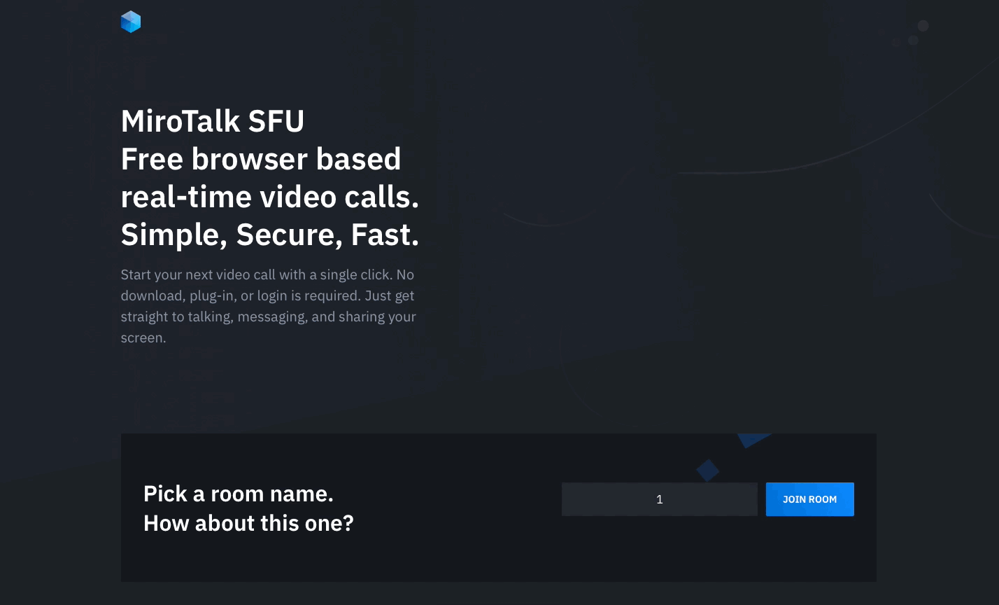

# <p align="center">G-Chat</p>

<p align="center">Free WebRTC - SFU - Simple, Secure, Scalable Real-Time Video Conferences Up to 4k, compatible with all browsers and platforms.</p>

<hr />

<hr />

<p align="center">
    
</p>

<hr />

<details>
<summary>Features</summary>

<br/>

-   Is `100% Free` - `Open Source` - `Self Hosted` and [PWA](https://en.wikipedia.org/wiki/Progressive_web_application)!
-   No download, plug-in or login required, entirely browser-based
-   Unlimited number of conference rooms, without call time limitation
-   Desktop and Mobile compatible
-   Translated in 133 languages
-   Optimized Room URL Sharing (share it to your participants, wait for them to join)
-   Possibility to Password protect the Room for the meeting
-   Webcam Streaming up to 4K quality (Front - Rear for mobile)
-   Echo cancellation and noise suppression that makes your audio crystal clear
-   Screen Sharing to present documents, slides, and more ...
-   File Sharing (with drag-and-drop), share any files to your participants in the room
-   Take a snapshot from the video frame(screen/cam) to save it as an image on your device.
-   Chat with Emoji Picker to show you feeling and the possibility to Save the conversations
-   Speech recognition, execute the app features simply with your voice.
-   Advance collaborative whiteboard for the teachers
-   Select Microphone - Speaker and Video source
-   Recording your Screen, Audio, or Video
-   Share any YouTube video in real-time to your participants
-   Share any mp4, webm, ogg video in real-time to your participants with possibility to download it
-   Full-Screen Mode on mouse click on the Video element
-   Possibility to Change UI Themes
-   Possibility to protect your Host with username and password (default disabled)
-   Supports [REST API](app/api/README.md) (Application Programming Interface)
-   [Slack](https://api.slack.com/apps/) API integration
-   [Sentry](https://sentry.io/) error reporting

</details>

<details>
<summary>Direct Join</summary>

<br/>

-   You can `join` directly to `room` by going to

    | Params   | Type           | Description     |
    | -------- | -------------- | --------------- |
    | room     | string         | room Id         |
    | password | string/boolean | room password   |
    | name     | string         | user name       |
    | audio    | boolean        | audio stream    |
    | video    | boolean        | video stream    |
    | screen   | boolean        | screen stream   |
    | notify   | boolean        | welcome message |

</details>

<details>
<summary>Embed a meeting</summary>

<br/>

Embedding a meeting into a service or app using an iframe.

```html
<iframe
    allow="camera; microphone; fullscreen; display-capture; autoplay"
    src=""
    style="height: 100%; width: 100%; border: 0px;"
></iframe>
```

</details>

<details open>
<summary>Quick Start</summary>

<br/>

-   You will need to have `NodeJS` and all [requirements](https://mediasoup.org/documentation/v3/mediasoup/installation/#requirements) installed, this project has been tested with Node versions [12.X](https://nodejs.org/en/blog/release/v12.22.1/) - [14.X](https://nodejs.org/en/blog/release/v14.17.5/) - [16.X](https://nodejs.org/en/blog/release/v16.15.0/).

-   Requirements install example for `Ubuntu 20.04`

```bash
# Gcc g++ make
$ apt-get update
$ apt-get install -y build-essential
# Python 3.8 and pip
$ DEBIAN_FRONTEND=noninteractive apt-get install -y tzdata
$ apt install -y software-properties-common
$ add-apt-repository ppa:deadsnakes/ppa
$ apt update
$ apt install -y python3.8 python3-pip
# NodeJS 16.X and npm
$ apt install -y curl dirmngr apt-transport-https lsb-release ca-certificates
$ curl -sL https://deb.nodesource.com/setup_16.x | bash -
$ apt-get install -y nodejs
$ npm install -g npm@latest
```

-   Start the server

```bash
# Clone this repo
$ git clone https://github.com/aayushray/G-Chat.git
# Go to to dir mirotalksfu
$ cd G-Chat
# Copy app/src/config.template.js in app/src/config.js and edit it if needed
$ cp app/src/config.template.js app/src/config.js
# Install dependencies - be patient, the first time will take a few minutes, in the meantime have a good coffee ;)
$ npm install
# Start the server
$ npm start
# If you want to start the server on a different port than the default use an env var
$ PORT=3011 npm start
```

-   Open in browser https://localhost:3010 or `:3011` if default port changed.

</details>

<details open>
<summary>Docker</summary>

<br/>


-   Install docker engine: https://docs.docker.com/engine/install/
-   Install docker compose: https://docs.docker.com/compose/install/
-   Repository docker hub: https://hub.docker.com/r/mirotalk/sfu

```bash
# Copy app/src/config.template.js in app/src/config.js IMPORTANT (edit it according to your needs)
$ cp app/src/config.template.js app/src/config.js
# Copy docker-compose.template.yml in docker-compose.yml and edit it if needed
$ cp docker-compose.template.yml docker-compose.yml
# (Optional) Get official image from Docker Hub
$ docker-compose pull
# Create and start containers
$ docker-compose up # -d
# To stop and remove resources
$ docker-compose down
```

-   Open in browser https://localhost:3010

</details>

<details>
<summary>Ngrok - Https</summary>

<br/>

You can start videoconferencing directly from your Local PC, and be reachable from any device outside your network, simply by following [these documentation](docs/ngrok.md).

</details>

<details>
<summary>Self Hosting</summary>

<br/>

-   [How to Self-Hosting](docs/self-hosting.md)

</details>

<details>
<summary>Notes</summary>

<br/>

-   Run the project on a `Linux or Mac` system as the `mediasoup` installation could have issues on `Windows`.

</details>

<details>
<summary>Rest API</summary>

<br/>

-   The API documentation uses [swagger](https://swagger.io/) at https://localhost:3010/api/v1/docs or check it on live [here](https://sfu.mirotalk.com/api/v1/docs).

```bash
# The response will give you a entrypoint / Room URL for your meeting.
$ curl -X POST "http://localhost:3010/api/v1/meeting" -H "authorization: mirotalksfu_default_secret" -H "Content-Type: application/json"
$ curl -X POST "https://sfu.mirotalk.com/api/v1/meeting" -H "authorization: mirotalksfu_default_secret" -H "Content-Type: application/json"
# The response will give you a entrypoint / URL for the direct join to the meeting.
$ curl -X POST "http://localhost:3010/api/v1/join" -H "authorization: mirotalksfu_default_secret" -H "Content-Type: application/json" --data '{"room":"test","name":"mirotalksfu","audio":"0","video":"0","screen":"0","notify":"0"}'
$ curl -X POST "https://sfu.mirotalk.com/api/v1/join" -H "authorization: mirotalksfu_default_secret" -H "Content-Type: application/json" --data '{"room":"test","name":"mirotalksfu","audio":"0","video":"0","screen":"0","notify":"0"}'
```

</details>
